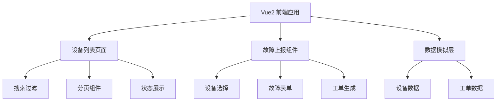

## 1. 架构设计



## 2. 技术描述
- **前端**：Vue@2.7.16 + Vue Router@3 + Element UI@2.15.14
- **构建工具**：Vue CLI
- **UI组件库**：Element UI（Vue2版本）
- **数据**：使用Mock数据模拟后端接口
- **样式**：CSS + Element UI 主题定制

## 3. 目录结构

```
├── public/
├── src/
│   ├── components/
│   │   ├── DeviceList.vue      # 设备列表组件
│   │   ├── FaultReportModal.vue # 故障上报弹窗
│   │   └── Pagination.vue       # 分页组件
│   ├── views/
│   │   └── Home.vue           # 主页面
│   ├── mock/
│   │   └── data.js            # 模拟数据
│   ├── utils/
│   │   └── workOrder.js       # 工单编号生成工具
│   ├── App.vue
│   └── main.js
├── package.json
└── vue.config.js
```

## 4. 数据模型

### 4.1 设备数据模型
```javascript
{
  id: Number,
  deviceCode: String,      // 设备编号
  community: String,     // 所属社区
  location: String,        // 安放点位
  status: String,        // 运行状态: running/fault/offline/maintenance
  statusText: String,      // 状态文本
  lastOnline: String,      // 最后在线时间
  installDate: String       // 安装日期
}
```

### 4.2 工单数据模型
```javascript
{
  workOrderNo: String,     // 工单编号
  deviceCode: String,      // 设备编号
  faultDescription: String, // 故障说明
  reportTime: String,      // 上报时间
  status: String         // 工单状态
}
```

## 5. 核心功能实现

### 5.1 工单编号生成规则
- 格式：WO + 年月日时分秒 + 4位随机数
- 示例：WO202605181430251234

### 5.2 搜索功能
- 支持设备编号模糊搜索
- 支持社区名称模糊搜索
- 支持重置搜索条件

### 5.3 分页功能
- 支持每页条数切换（10/20/50条/页）
- 支持页码跳转
- 显示总条数和当前页码信息
