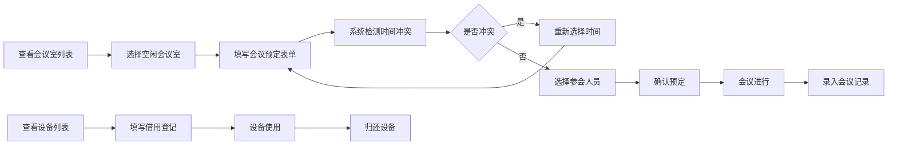

## 1. 产品概述
会议管理系统是一个用于企业内部会议室资源管理、会议预定、参会人员管理、会议记录和设备借用的综合性管理平台。通过数字化手段提升会议室使用效率，简化会议预定流程，方便会议记录追溯和设备资源管理。

## 2. 核心功能

### 2.1 用户角色
| 角色 | 注册方式 | 核心权限 |
|------|----------|----------|
| 普通用户 | 企业账号登录 | 查看会议室、预定会议、查看会议记录、借用设备 |
| 管理员 | 管理员账号 | 所有普通用户权限 + 会议室管理、设备管理、会议记录管理 |

### 2.2 功能模块
1. **会议室管理**：会议室列表展示、会议室详情查看、会议室状态显示
2. **会议预定**：会议信息填写、时间段选择、会议室预约冲突检测
3. **参会人员**：人员列表展示、多选/搜索、参会状态管理
4. **会议记录**：会议列表展示、会议详情查看、会议纪要管理
5. **设备借用**：设备列表展示、借用登记、归还管理、借用记录

### 2.3 页面详情
| 页面名称 | 模块名称 | 功能描述 |
|----------|----------|------------|
| 主页面 | 顶部导航 | 页面切换、用户信息展示 |
| 主页面 | 侧边菜单 | 功能模块快速导航 |
| 会议室列表 | 表格展示 | 展示会议室名称、容量、设备、状态 |
| 会议室列表 | 状态筛选 | 按空闲/使用中/维护中筛选 |
| 会议预定 | 表单组件 | 会议主题、时间、会议室、参会人员填写 |
| 会议预定 | 表单校验 | 必填项校验、时间冲突检测 |
| 参会人员选择 | 人员列表 | 展示可选择的参会人员 |
| 参会人员选择 | 搜索筛选 | 按部门、姓名搜索筛选 |
| 会议记录列表 | 表格展示 | 展示历史会议、会议状态、纪要 |
| 设备借用登记 | 设备列表 | 展示可借用设备及状态 |
| 设备借用登记 | 借用表单 | 借用时间、归还时间、借用人填写 |

## 3. 核心流程
用户登录系统后，可查看所有会议室状态。需要开会时，填写会议预定表单选择会议室和时间段，系统自动检测冲突。确认后添加参会人员，会议结束后可录入会议纪要。需要使用设备时，可进行设备借用登记，使用完毕后归还。

## 4. 用户界面设计

### 4.1 设计风格
- **主色调**：蓝色系 (#409EFF)，体现专业、稳重的企业风格
- **辅助色**：绿色 (#67C23A) 表示成功/空闲，橙色 (#E6A23C) 表示警告，红色 (#F56C6C) 表示错误/占用
- **按钮风格**：圆角按钮，悬停时有轻微阴影和颜色变化
- **字体**：使用系统默认无衬线字体，标题加粗，正文清晰易读
- **布局风格**：经典后台管理布局，左侧菜单 + 顶部导航 + 右侧内容区，卡片式内容展示
- **图标**：使用 ElementUI 内置图标，统一风格

### 4.2 页面设计概述
| 页面名称 | 模块名称 | UI 元素 |
|----------|----------|----------|
| 会议室列表 | 表格区域 | 条纹表格、状态标签、操作按钮、搜索栏 |
| 会议预定 | 表单区域 | 输入框、日期选择器、时间选择器、下拉选择、复选框组 |
| 参会人员 | 选择区域 | 树形选择器、搜索框、已选人员标签、确认按钮 |
| 会议记录 | 列表区域 | 时间线样式、会议卡片、详情展开、分页 |
| 设备借用 | 登记区域 | 设备卡片、借用表单、状态徽章、借用记录表格 |

### 4.3 响应式
- 采用桌面优先设计，适配 1280px 及以上分辨率
- 侧边菜单可折叠，适应不同屏幕宽度
- 表格支持横向滚动，小屏幕下保证数据完整展示
