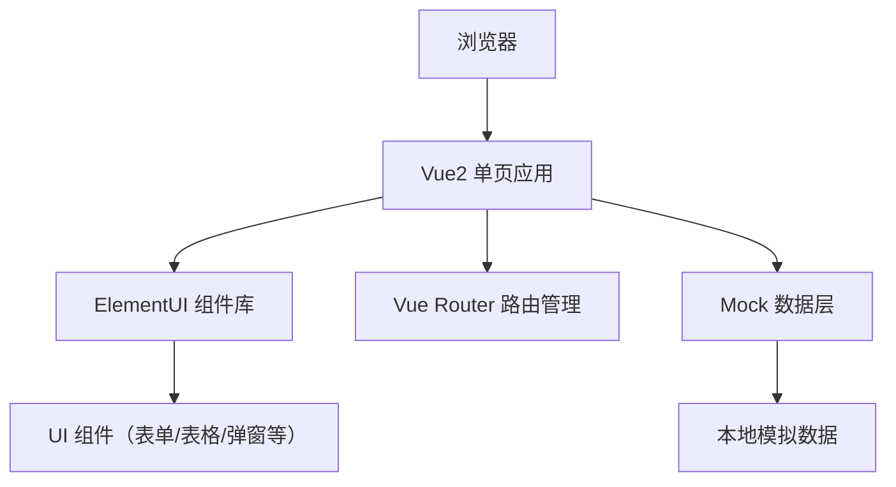

## 1. 架构设计



## 2. 技术说明
- **前端框架**：Vue@2.7 + Vue Router@3 + ElementUI@2.15
- **构建工具**：Vite@4
- **样式方案**：SCSS + ElementUI 主题定制
- **数据管理**：Vue 组件内状态 + 本地 Mock 数据
- **图标**：ElementUI 内置图标

## 3. 路由定义
| 路由 | 页面 | 说明 |
|------|------|------|
| / | 会议室列表 | 首页，展示所有会议室信息 |
| /booking | 会议预定 | 会议预定表单页面 |
| /records | 会议记录 | 历史会议记录列表 |
| /equipment | 设备借用 | 设备借用登记页面 |

## 4. 数据模型

### 4.1 会议室 (MeetingRoom)
| 字段 | 类型 | 说明 |
|------|------|------|
| id | Number | 主键ID |
| name | String | 会议室名称 |
| capacity | Number | 容纳人数 |
| location | String | 位置 |
| equipment | Array | 配备设备 |
| status | String | 状态：available/occupied/maintenance |

### 4.2 会议 (Meeting)
| 字段 | 类型 | 说明 |
|------|------|------|
| id | Number | 主键ID |
| title | String | 会议主题 |
| roomId | Number | 会议室ID |
| date | String | 会议日期 |
| startTime | String | 开始时间 |
| endTime | String | 结束时间 |
| organizer | String | 组织者 |
| attendees | Array | 参会人员 |
| description | String | 会议描述 |
| minutes | String | 会议纪要 |
| status | String | 状态：upcoming/completed/cancelled |

### 4.3 员工 (Employee)
| 字段 | 类型 | 说明 |
|------|------|------|
| id | Number | 主键ID |
| name | String | 姓名 |
| department | String | 部门 |
| position | String | 职位 |
| email | String | 邮箱 |

### 4.4 设备 (Equipment)
| 字段 | 类型 | 说明 |
|------|------|------|
| id | Number | 主键ID |
| name | String | 设备名称 |
| model | String | 型号 |
| status | String | 状态：available/borrowed/maintenance |
| borrower | String | 借用人 |
| borrowDate | String | 借用日期 |
| expectedReturn | String | 预计归还日期 |

## 5. 目录结构
```
src/
├── components/         # 公共组件
│   ├── AttendeeSelect.vue    # 参会人员选择组件
│   └── StatusTag.vue         # 状态标签组件
├── views/              # 页面视图
│   ├── RoomList.vue          # 会议室列表
│   ├── BookingForm.vue       # 会议预定
│   ├── MeetingRecords.vue    # 会议记录
│   └── EquipmentBorrow.vue   # 设备借用
├── mock/               # Mock 数据
│   ├── rooms.js              # 会议室数据
│   ├── meetings.js           # 会议数据
│   ├── employees.js          # 员工数据
│   └── equipment.js          # 设备数据
├── router/             # 路由配置
│   └── index.js
├── App.vue             # 根组件
├── main.js             # 入口文件
└── styles/             # 全局样式
    └── index.scss
```
