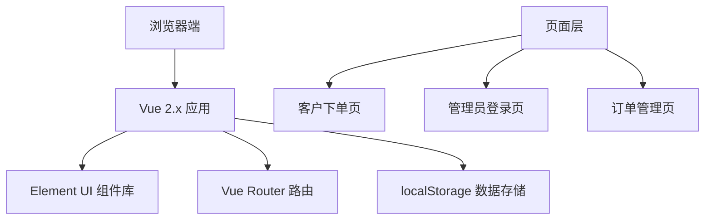

## 1. 架构设计



## 2. 技术选型

- **前端框架**: Vue 2.7.x
- **UI 组件库**: Element UI 2.15.x
- **路由管理**: Vue Router 3.6.x
- **构建工具**: Vue CLI 5.x 或 Vite 2.x
- **数据存储**: localStorage（模拟后端）
- **样式方案**: SCSS / CSS

## 3. 路由定义

| 路由路径 | 页面名称 | 说明 |
|---------|----------|------|
| / | 客户下单页 | 宣纸笺定制表单 |
| /admin/login | 管理员登录页 | 管理员身份验证 |
| /admin/orders | 订单管理页 | 订单列表与工序管理 |

## 4. 数据模型

### 4.1 订单数据结构

```javascript
{
  id: "XZ202401010001",        // 订单编号
  category: "生宣",            // 宣纸品类
  size: {                     // 尺寸规格
    width: 138,               // 宽度（cm）
    height: 69,               // 高度（cm）
    name: "四尺整张"           // 规格名称
  },
  curtainPattern: "单丝路",    // 帘纹款式
  goldProcesses: ["描金龙"],   // 描金工艺（多选）
  packaging: "锦盒装",         // 包装方式
  quantity: 10,               // 数量
  remark: "",                 // 备注
  status: "pending",          // 订单状态：pending/processing/completed
  currentStep: 0,             // 当前工序（0-7）
  steps: [                    // 工序列表
    { name: "选纸", completed: false, time: null },
    { name: "裁切", completed: false, time: null },
    { name: "水印", completed: false, time: null },
    { name: "描金", completed: false, time: null },
    { name: "压平", completed: false, time: null },
    { name: "包装", completed: false, time: null },
    { name: "质检", completed: false, time: null },
    { name: "完工", completed: false, time: null }
  ],
  createdAt: "2024-01-01 10:30:00",
  customerName: "",
  customerPhone: ""
}
```

### 4.2 选项数据

```javascript
// 宣纸品类
const paperCategories = [
  { value: '生宣', label: '生宣', price: 5 },
  { value: '熟宣', label: '熟宣', price: 6 },
  { value: '半生熟', label: '半生熟', price: 5.5 },
  { value: '皮纸', label: '皮纸', price: 8 },
  { value: '麻纸', label: '麻纸', price: 7 }
]

// 常用尺寸规格
const sizePresets = [
  { name: '四尺整张', width: 138, height: 69 },
  { name: '四尺对开', width: 138, height: 34.5 },
  { name: '六尺整张', width: 180, height: 97 },
  { name: '六尺对开', width: 180, height: 48.5 },
  { name: '八尺整张', width: 248, height: 129 }
]

// 帘纹款式
const curtainPatterns = [
  { value: '单丝路', label: '单丝路' },
  { value: '双丝路', label: '双丝路' },
  { value: '罗纹', label: '罗纹' },
  { value: '龟纹', label: '龟纹' },
  { value: '绳纹', label: '绳纹' },
  { value: '回纹', label: '回纹' }
]

// 描金工艺
const goldProcessOptions = [
  { value: '描金龙', label: '描金龙', price: 20 },
  { value: '描金凤', label: '描金凤', price: 20 },
  { value: '描金云纹', label: '描金云纹', price: 15 },
  { value: '描金山水', label: '描金山水', price: 25 },
  { value: '描金花卉', label: '描金花卉', price: 18 }
]

// 包装方式
const packagingOptions = [
  { value: '简装', label: '简装', price: 5 },
  { value: '锦盒装', label: '锦盒装', price: 30 },
  { value: '卷轴装', label: '卷轴装', price: 50 }
]
```

## 5. 项目目录结构

```
src/
├── assets/              # 静态资源
│   ├── styles/          # 全局样式
│   └── images/          # 图片资源
├── components/          # 公共组件
│   ├── OrderForm.vue    # 订单表单组件
│   └── ProcessSteps.vue # 生产工序组件
├── views/               # 页面组件
│   ├── OrderPage.vue    # 客户下单页
│   ├── Login.vue        # 管理员登录页
│   └── AdminOrders.vue  # 订单管理页
├── router/              # 路由配置
│   └── index.js
├── utils/               # 工具函数
│   └── storage.js       # 本地存储封装
├── mock/                # 模拟数据
│   └── data.js
├── App.vue
└── main.js
```

## 6. 核心功能实现说明

### 6.1 客户下单页
- 使用 Element UI Form 组件进行表单分组
- 尺寸规格支持预设快速选择和自定义输入
- 描金工艺使用 Checkbox Group 多选
- 实时计算总价：(纸张单价 × 数量) + 描金工艺总价 + 包装费用
- 表单提交前进行必填项验证

### 6.2 订单管理页
- 使用 Table 组件展示订单列表
- 生产工序使用 Steps 步骤条组件可视化展示
- 点击"完成"按钮更新工序状态，自动进入下一道工序
- 支持按订单状态筛选（待处理、生产中、已完成）
- 工序全部完成后订单状态自动变为"已完成"

### 6.3 数据持久化
- 使用 localStorage 存储订单数据
- 提供订单增删改查的工具函数
- 页面刷新后数据不丢失
