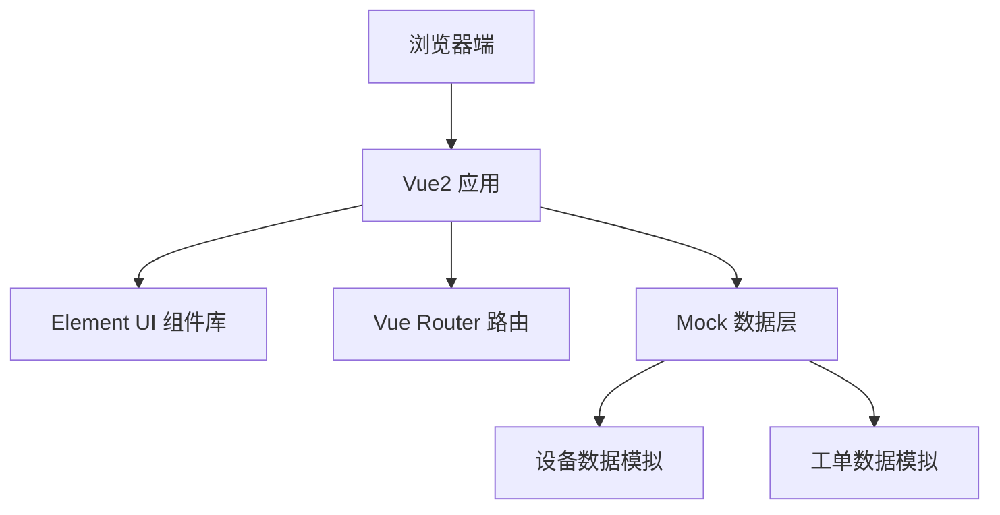

## 1. 架构设计



本项目为纯前端单页应用，使用 Vue2 + Element UI 构建，所有数据使用 Mock 数据模拟，无需后端服务支持。

## 2. 技术描述

- **前端框架**：Vue@2.7.x
- **UI 组件库**：Element UI@2.15.x
- **构建工具**：Vue CLI
- **路由管理**：Vue Router@3.x
- **数据模拟**：前端 Mock 数据
- **样式方案**：SCSS / Element UI 内置样式

## 3. 目录结构

```
├── src/
│   ├── assets/          # 静态资源
│   ├── components/      # 公共组件
│   ├── views/           # 页面组件
│   │   ├── DeviceList.vue    # 设备列表页
│   │   └── WorkOrderList.vue # 工单列表页
│   ├── router/          # 路由配置
│   ├── mock/            # Mock 数据
│   │   ├── device.js    # 设备数据
│   │   └── workOrder.js # 工单数据
│   ├── App.vue          # 根组件
│   └── main.js          # 入口文件
├── public/
├── package.json
└── vue.config.js
```

## 4. 路由定义

| 路由路径 | 页面名称 | 说明 |
|----------|----------|------|
| / | 设备列表页 | 设备列表展示、搜索、分页、故障提报入口 |
| /workorder | 工单列表页 | 工单列表展示、工单状态追踪 |

## 5. 数据模型

### 5.1 设备数据模型

```javascript
{
  id: String,           // 设备ID
  deviceNo: String,     // 设备编号
  organization: String, // 人才服务中心名称
  location: String,     // 摆放区域
  status: String,       // 运行状态: online/offline/fault
  lastOnlineTime: String, // 最后在线时间
  createTime: String    // 设备创建时间
}
```

### 5.2 工单数据模型

```javascript
{
  id: String,           // 工单ID
  workOrderNo: String,  // 工单编号
  deviceId: String,     // 关联设备ID
  deviceNo: String,     // 设备编号
  organization: String, // 人才服务中心
  problemDesc: String,  // 问题描述
  status: String,       // 工单状态: pending/processing/resolved/closed
  createTime: String,   // 创建时间
  updateTime: String    // 更新时间
}
```

## 6. 关键功能实现方案

### 6.1 分页组件实现
- 使用 Element UI 的 el-pagination 组件
- 支持 total、pageSize、currentPage 双向绑定
- 支持每页条数切换（10/20/50/100）
- 支持跳转到指定页码

### 6.2 模糊检索实现
- 前端基于数组 filter 方法实现
- 支持设备编号和机构名称多字段匹配
- 使用 toLowerCase() 实现不区分大小写搜索

### 6.3 状态颜色标识
- 在线（online）：绿色标签，success 类型
- 离线（offline）：橙色标签，warning 类型
- 故障（fault）：红色标签，danger 类型

### 6.4 工单编号生成规则
- 格式：`WO` + 年月日（8位） + 时间戳后6位 + 随机数3位
- 示例：`WO20260518123456789`
- 确保全局唯一性

### 6.5 故障提报弹窗
- 使用 el-dialog 组件
- 表单验证：设备必选、问题描述必填（至少10字）
- 提交成功后自动关闭弹窗并刷新工单数据
