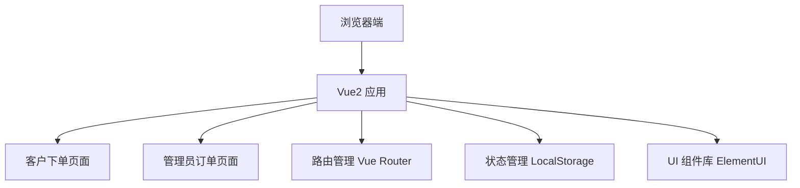

## 1. 架构设计



## 2. 技术描述

- 前端框架：Vue@2.7.x（支持 Options API）
- UI 组件库：ElementUI@2.15.x
- 构建工具：Vue CLI 或 Vite
- 路由管理：Vue Router@3.x
- 数据持久化：LocalStorage（模拟后端存储）
- 样式：SCSS + ElementUI 主题定制

## 3. 路由定义

| 路由 | 页面 | 功能 |
|------|------|------|
| / | 客户下单页 | 缂丝扇面定制表单填写与提交 |
| /admin | 管理员订单页 | 订单列表展示与生产工序管理 |

## 4. 数据模型

### 4.1 订单数据结构

```javascript
{
  id: String,           // 订单编号
  orderNo: String,      // 订单号
  material: String,     // 丝线材质
  sizeWidth: Number,    // 扇面宽度(cm)
  sizeHeight: Number,   // 扇面高度(cm)
  pattern: String,      // 纹样题材
  density: String,      // 织造密度
  edgeType: String,     // 包边方式
  customerName: String, // 客户姓名
  customerPhone: String,// 客户电话
  remark: String,       // 备注
  status: String,       // 订单状态：pending/processing/completed
  currentStep: Number,  // 当前工序进度 0-7
  createTime: Number,   // 创建时间
  steps: [              // 8道生产工序
    { name: '经线', completed: false, time: null },
    { name: '纹样起稿', completed: false, time: null },
    { name: '戗色织造', completed: false, time: null },
    { name: '修剪', completed: false, time: null },
    { name: '包边', completed: false, time: null },
    { name: '整烫', completed: false, time: null },
    { name: '质检', completed: false, time: null },
    { name: '完工', completed: false, time: null }
  ]
}
```

### 4.2 选项配置数据

```javascript
// 丝线材质
const materials = [
  { value: 'silk-100', label: '100%桑蚕丝', price: 200 },
  { value: 'silk-mix', label: '桑蚕丝混纺', price: 150 },
  { value: 'tussah', label: '柞蚕丝', price: 180 },
  { value: 'brocade', label: '织锦缎', price: 250 }
]

// 纹样题材
const patterns = [
  { value: 'landscape', label: '山水' },
  { value: 'flower', label: '花卉' },
  { value: 'figure', label: '人物' },
  { value: 'bird', label: '花鸟' },
  { value: 'calligraphy', label: '书法' },
  { value: 'dragon', label: '龙凤' }
]

// 织造密度
const densities = [
  { value: 'normal', label: '常规密度(80经/吋)' },
  { value: 'high', label: '高密度(120经/吋)' },
  { value: 'super', label: '超高密度(160经/吋)' }
]

// 包边方式
const edgeTypes = [
  { value: 'normal', label: '普通包边' },
  { value: 'silk', label: '真丝滚边' },
  { value: 'gold', label: '金线包边' },
  { value: 'jade', label: '玉石包边' }
]
```

## 5. 组件划分

### 5.1 客户下单页组件
- OrderForm.vue：主表单组件
- MaterialSelector.vue：材质选择器
- SizeInput.vue：尺寸输入组件
- PatternSelector.vue：纹样选择器
- DensitySelector.vue：密度选择器
- EdgeSelector.vue：包边选择器

### 5.2 管理员订单页组件
- OrderList.vue：订单列表组件
- OrderCard.vue：订单卡片组件
- ProcessTimeline.vue：工序时间线组件
- StepProgress.vue：工序进度组件

## 6. 项目结构

```
src/
├── main.js              # 入口文件
├── App.vue              # 根组件
├── router/
│   └── index.js         # 路由配置
├── views/
│   ├── OrderPage.vue    # 客户下单页
│   └── AdminPage.vue    # 管理员订单页
├── components/
│   ├── OrderForm.vue    # 订单表单
│   ├── OrderList.vue    # 订单列表
│   └── ProcessSteps.vue # 工序步骤
├── mock/
│   └── data.js          # 模拟数据
├── utils/
│   └── storage.js       # 本地存储工具
└── styles/
    └── index.scss       # 全局样式
```
