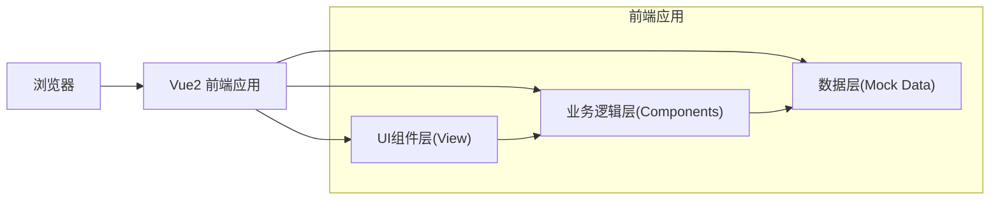

## 1. 架构设计



## 2. 技术描述
- 前端框架：Vue@2.7.14
- UI组件库：Element UI@2.15.14
- 构建工具：Vue CLI 5 / Webpack 5
- 样式：SCSS
- 数据：Mock数据，前端模拟后端接口

## 3. 目录结构
```
library-terminal-admin/
├── public/
│   └── index.html
├── src/
│   ├── assets/
│   │   └── styles/
│   │       └── global.scss
│   ├── components/
│   │   ├── DeviceTable.vue      # 设备列表组件
│   │   ├── SearchBar.vue        # 搜索栏组件
│   │   └── RepairModal.vue      # 故障报修弹窗
│   ├── mock/
│   │   └── devices.js           # 模拟数据
│   ├── App.vue
│   ├── main.js
│   └── router.js
├── package.json
└── vue.config.js
```

## 4. 数据模型

### 设备数据模型
```javascript
{
  id: Number,              // 设备ID
  deviceCode: String,      // 设备编号
  branchName: String,      // 分馆位置
  floor: String,           // 部署楼层
  status: String,          // 运行状态: online/offline/fault/maintaining
  lastHeartbeat: String,   // 最后心跳时间
  createTime: String       // 部署时间
}
```

### 工单数据模型
```javascript
{
  orderNo: String,         // 工单号
  deviceId: Number,        // 设备ID
  deviceCode: String,      // 设备编号
  branchName: String,      // 分馆名称
  problem: String,         // 问题描述
  reporter: String,        // 报修人
  createTime: String,      // 报修时间
  status: String           // 工单状态
}
```

## 5. 核心功能实现

### 5.1 分页功能
- 使用Element UI的Pagination组件
- 每页显示10条数据
- 支持页码跳转和上下页切换

### 5.2 搜索功能
- 按设备编号模糊搜索
- 按分馆名称模糊搜索
- 支持组合搜索条件

### 5.3 故障报修功能
- 点击报修按钮打开弹窗
- 自动填充选中设备信息
- 系统自动生成工单号（格式：GD + 时间戳 + 4位随机数）
- 表单验证后提交
- 提交成功后更新设备状态为"维护中"

### 5.4 状态样式区分
- 在线：绿色标签(#f6ffed) + 绿色文字(#52c41a)
- 离线：灰色标签(#fafafa) + 灰色文字(#8c8c8c)
- 故障：红色标签(#fff1f0) + 红色文字(#ff4d4f)
- 维护中：橙色标签(#fff7e6) + 橙色文字(#faad14)
