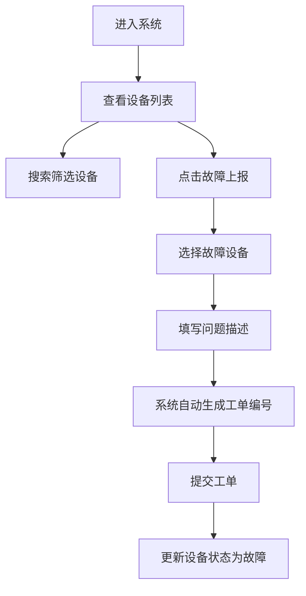

## 1. 产品概述

市民服务中心自助综合办理终端运维管理系统，用于管理和监控各服务大厅布设的自助终端设备，提供设备状态监控、故障上报、工单管理等功能，提升运维效率和设备可用性。

## 2. 核心 Features

### 2.1 用户角色

| 角色 | 注册方式 | 核心权限 |
|------|----------|----------|
| 运维管理员 | 系统分配 | 查看设备列表、故障上报、工单管理、搜索筛选 |

### 2.2 Feature 模块

1. **设备管理列表**：分页展示设备信息，包含设备编号、服务大厅、布设区域、运行状态
2. **故障上报功能**：弹窗选择故障设备并填写问题描述，自动生成工单编号
3. **搜索筛选**：支持按设备编号、大厅名称进行搜索过滤
4. **状态可视化**：不同设备运行状态采用不同样式区分显示

### 2.3 页面详情

| 页面名称 | 模块名称 | 功能描述 |
|---------|---------|----------|
| 设备管理主页 | 顶部导航栏 | 系统标题、用户信息展示 |
| 设备管理主页 | 搜索筛选区 | 设备编号搜索框、大厅名称搜索框、故障上报按钮 |
| 设备管理主页 | 设备列表区 | 分页表格展示设备信息，状态标签样式区分 |
| 设备管理主页 | 故障上报弹窗 | 设备选择下拉框、问题描述文本框、提交/取消按钮 |
| 设备管理主页 | 分页组件 | 页码切换、每页条数选择 |

## 3. 核心流程

## 4. 用户界面设计

### 4.1 设计风格
- 主色调：政务蓝 `#1677ff`，代表专业和信任
- 辅助色：绿色 `#52c41a`（正常）、橙色 `#faad14`（预警）、红色 `#ff4d4f`（故障）、灰色 `#8c8c8c`（离线）
- 按钮风格：圆角 6px，悬停阴影效果
- 字体：系统字体栈，14px 基础字号
- 布局风格：卡片式布局，顶部导航 + 内容区 + 表格
- 图标：使用简洁线性图标

### 4.2 页面设计概述

| 页面名称 | 模块名称 | UI 元素 |
|---------|---------|---------|
| 设备管理主页 | 顶部导航 | 深色背景，白色文字，系统标题居左 |
| 设备管理主页 | 搜索区 | 浅色卡片，输入框并排布局，蓝色搜索按钮 |
| 设备管理主页 | 列表区 | 白色卡片，斑马纹表格，状态标签带圆角和背景色 |
| 设备管理主页 | 弹窗 | 居中模态框，半透明遮罩，表单垂直布局 |
| 设备管理主页 | 分页 | 居右布局，页码按钮组 |

### 4.3 响应式
- 桌面端优先设计，适配 1280px 及以上分辨率
- 表格支持横向滚动以适配小屏幕
- 弹窗宽度固定 500px，移动端自适应

### 4.4 交互细节
- 状态标签：正常（绿色背景+图标）、预警（橙色背景+图标）、故障（红色背景+图标）、离线（灰色背景+图标）
- 悬停效果：表格行悬停高亮，按钮悬停变色
- 弹窗动画：淡入淡出，缩放过渡
