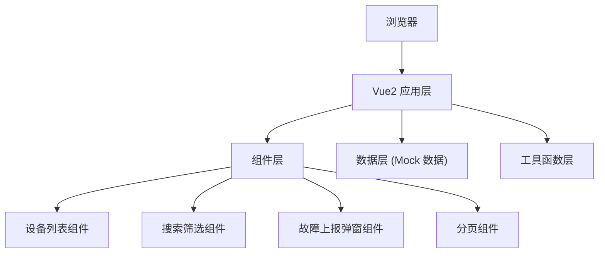

## 1. 架构设计



## 2. 技术描述
- 前端：Vue 2.7 + Vite 3 + TypeScript
- UI 框架：Tailwind CSS 3
- 状态管理：Vue Composition API (reactive/ref)
- 图标：Lucide Vue
- 后端：无后端，使用 Mock 数据
- 初始化工具：Vite 脚手架

## 3. 路由定义
| 路由 | 用途 |
|------|------|
| / | 设备管理主页 |

## 4. 数据模型

### 4.1 设备数据类型定义
```typescript
interface Device {
  id: string;
  deviceCode: string;      // 设备编号
  hallName: string;        // 服务大厅
  areaName: string;        // 布设区域
  status: 'normal' | 'warning' | 'fault' | 'offline';  // 运行状态
  lastOnline: string;      // 最后在线时间
  ipAddress: string;       // IP 地址
}

interface WorkOrder {
  id: string;
  orderNo: string;         // 工单编号
  deviceId: string;
  deviceCode: string;
  description: string;     // 问题描述
  createTime: string;
  status: 'pending' | 'processing' | 'resolved';
}

interface SearchParams {
  deviceCode: string;
  hallName: string;
}
```

### 4.2 Mock 数据
- 预置 30+ 条设备数据，覆盖 4 种状态
- 预置多个服务大厅和区域数据

## 5. 核心工具函数
- `generateOrderNo()`: 自动生成工单编号（格式：GD + 时间戳 + 随机数）
- `getStatusConfig(status)`: 获取状态配置（颜色、标签文字、图标）
- `formatDate(date)`: 日期格式化
