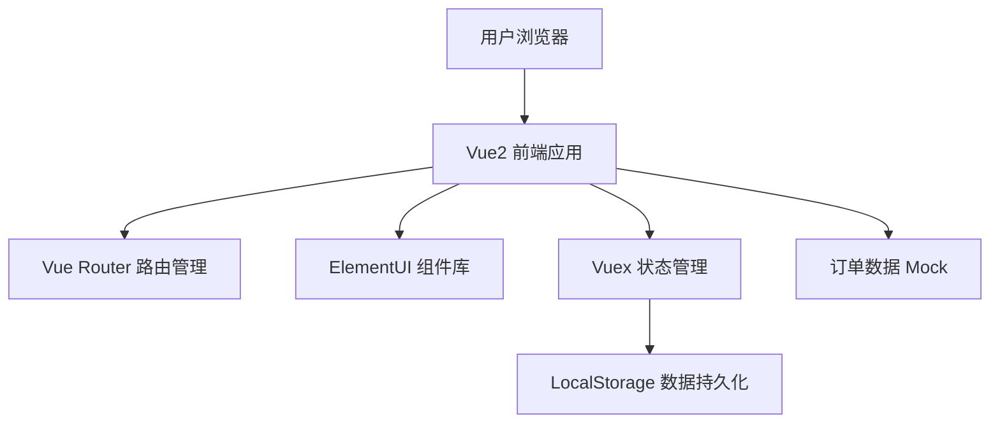

## 1. 架构设计



## 2. 技术选型

- **前端框架**：Vue@2.7.14（Vue2 最终版本，兼容 Composition API）
- **UI 组件库**：ElementUI@2.15.14
- **路由管理**：Vue Router@3.6.5
- **状态管理**：Vuex@3.6.2
- **构建工具**：Vue CLI@5.0.8
- **数据存储**：LocalStorage（模拟后端）
- **样式方案**：SCSS

## 3. 目录结构

```
├── src/
│   ├── assets/              # 静态资源
│   │   └── styles/          # 全局样式
│   ├── components/          # 公共组件
│   │   ├── OrderCard.vue    # 订单卡片组件
│   │   └── ProcessSteps.vue # 工序进度组件
│   ├── views/               # 页面组件
│   │   ├── OrderForm.vue    # 用户下单页
│   │   └── AdminPanel.vue   # 管理员管理页
│   ├── router/              # 路由配置
│   │   └── index.js
│   ├── store/               # Vuex 状态管理
│   │   └── index.js
│   ├── mock/                # Mock 数据
│   │   └── orders.js
│   ├── App.vue
│   └── main.js
├── public/
├── package.json
└── vue.config.js
```

## 4. 路由定义

| 路由 | 页面 | 说明 |
|------|------|------|
| / | 下单页面 | 用户定制果篮并提交订单 |
| /admin | 管理员页面 | 订单列表与工序管理 |
| /order/:id | 订单详情 | 查看订单详情与工序进度 |

## 5. 数据模型

### 5.1 订单数据结构

```javascript
{
  id: String,           // 订单号
  material: String,     // 藤条材质
  height: Number,       // 果篮高度(cm)
  diameter: Number,     // 口径大小(cm)
  style: String,        // 编织款式
  handle: String,       // 提手配置
  contact: String,      // 联系方式
  currentProcess: Number, // 当前工序(0-7)
  status: String,       // 订单状态：pending/processing/completed
  createdAt: Date,      // 下单时间
  processTimes: Array   // 各工序完成时间
}
```

### 5.2 工序列表

```javascript
[
  { id: 0, name: '选藤', icon: 'el-icon-box' },
  { id: 1, name: '软化', icon: 'el-icon-water-cup' },
  { id: 2, name: '打底', icon: 'el-icon-edit-outline' },
  { id: 3, name: '编身', icon: 'el-icon-c-scale-to-original' },
  { id: 4, name: '收口', icon: 'el-icon-circle-check' },
  { id: 5, name: '装提手', icon: 'el-icon-set-up' },
  { id: 6, name: '修整', icon: 'el-icon-brush' },
  { id: 7, name: '完工', icon: 'el-icon-present' }
]
```

## 6. 核心功能实现

### 6.1 用户下单
- 表单验证：所有字段必填，尺寸范围校验
- 订单生成：时间戳+随机数生成唯一订单号
- 数据存储：保存到 LocalStorage

### 6.2 管理员管理
- 订单列表：展示所有订单，支持按状态筛选
- 工序推进：点击按钮推进到下一个工序
- 进度展示：工序步骤条 + 进度百分比

### 6.3 状态管理
- Vuex 管理订单列表和当前订单
- LocalStorage 持久化存储
- 响应式更新界面
